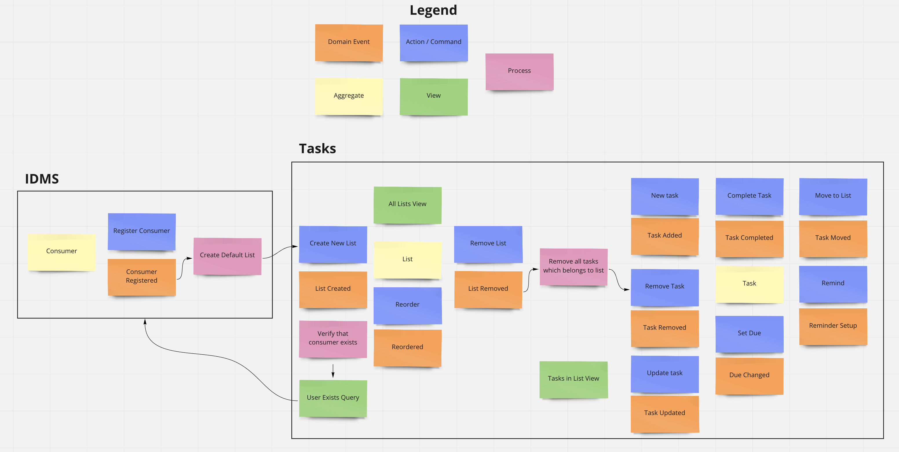

## Analysis of the domain

After checking existing applications, I've come up with the next building blocks.
 

I've decided to separate two bonded contexts:
- IDMS (Identity Management System), which is responsible for dealing with Consumers, registration, authorization, profiling, and other responsibilities like this.
It's a natural bounded context. As you can see at Google or Microsoft, you can log in with your account to multiple applications.
- Tasks, responsible for tasks organization and management.

### Tasks Aggregate Roots

I thought about the next options:
1) Make List and Task two separate aggregate roots.
2) Make a List of a single aggregate root for all the actions.

In this case, the decisive factor will be how you threat a List in the Tasks bounded context.

Suppose you treat List as a reference to your Task, which can or can't exist. So that Task can live independently from the List, and in the case when referring to List does not exist, then Task will appear in some "default tasks view."
I've decided to go with this option and implement the first option with two aggregate roots.

Also, it fair to think that Consumers can create tasks only in the List. It means that Task can exist without the List. In this case, having List as an aggregate root is OK.
