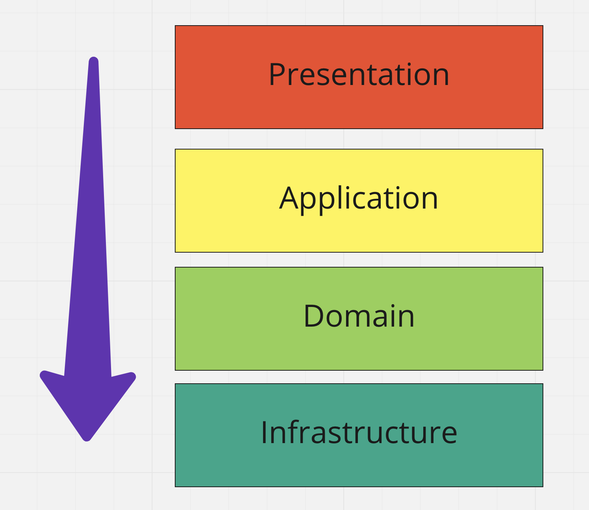

## Project structure

In this project, I'm implementing DDD with the CQRS pattern.
At the moment of writing, this project includes two bounded contexts, each context includes at least four layers: 
- Presentation: end-user/system interface (e.g, UI, API)
- Application: high-level application logic (e.g., transactions management, commands handling/routing, etc.)
- Domain: business rules store here.
- Infrastructure: underlying layer (persistence, integration with other systems, etc.)

### Layers communication

The rule is that top-level layers should not depend on low-level implementation details, 
instead top-level component define an interface which low level can implement, this principle is called **dependency inversion**.



### Filesystem structure

```
├── IDMS (Bounded context)
│   ├── Application
│   │   ├── Command (Space for commands)
│   │   │   ├── RegisterConsumer
│   │   ├── Query (Space for queries)
│   │   │   └── FindConsumerById
│   │   ├── CommandHandler (Space for command handlers, also called use cases)
│   │   │   └── RegisterConsumerCommandHandler
│   │   ├── QueryHandler (Space for query handlers)
│   │   │   └── FindConsumerByIdQueryHandler
│   │   ├── ReadModel
│   │   │   └── ConsumerReadModel
│   │   └── Saga
│   │       └── RegistrationSaga
│   │   
│   ├── Domain
│   │   └── Model
│   │   │   └── Consumer (Entities, VOs)
│   │   │       └── Event (Domain Events)
│   │   └── Repository (Repository interfaces)
│   │   │   └── ConsumerRepositoryInterface
│   │   └── Service (Domain services and interfaces)
│   │   └── Exception (Domain errors)
│   │       └── ConsumerNotFoundException
│   │   
│   ├── Infrastructure
│   │   └── Persistence (Everything related to the persistence layer)
│   │   └── Service (Implementation of any required services)
│   └── Presentation
│       └── REST (Type of presentation layer)
│           ├── Controller
|           └── Request (DTO's for presentation layer)
│       
└── Library (A set of libraries which can be published)
    ├── DomainFramework (Things relared to the implementation of DDD)
    └── ApplicationFramework (Empower application development)
```
