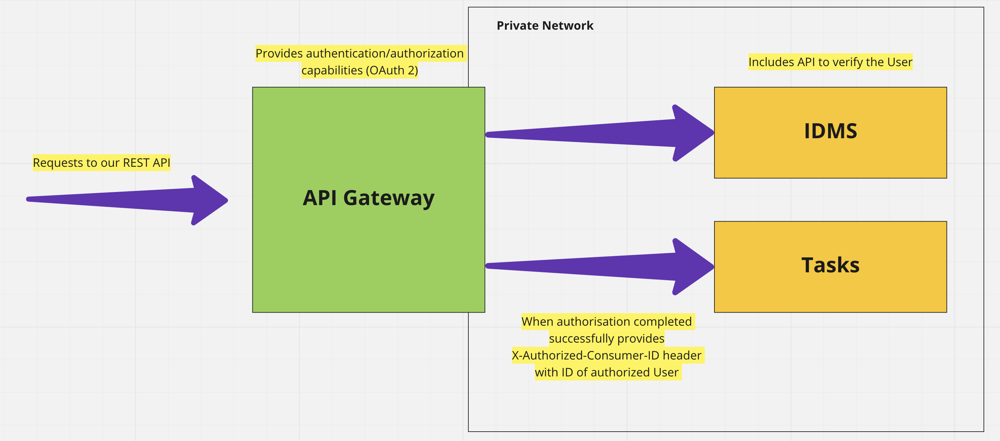

## Authorization

In the scope of this project, I assume that authorization and tokens management is not a responsibility of the IDMS 
and can be organized on the API Gateway/Management platform level.

IDMS can provide an API for authentication like:
```
POST /authenticate
{
    "username": "MyName",
    "password": "MyPassword"
}
```
Which is responsible only for verifying that user exists and is active and potentially provides several roles.
Then the API platform will generate all the required tokens and return them to the end-user.

On the next call with those tokens, the API platform is responsible for verifying the validity of the token 
and in case it's valid to set up a unique header that indicates that the user successfully authorized.

Here is how this flow can look like:


On the application side, I've introduced authorization context, which allows receiving requester ID, 
which then we can compare with object/resource owner and act on it accordingly.

