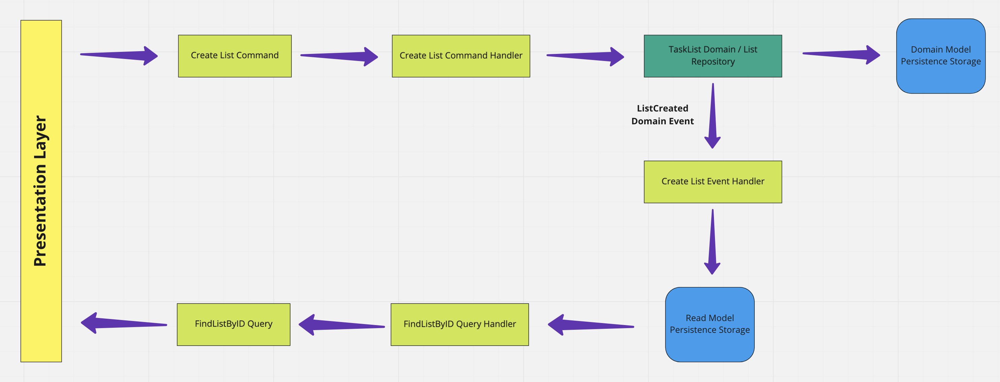
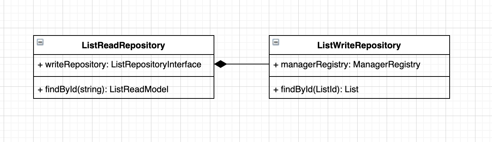
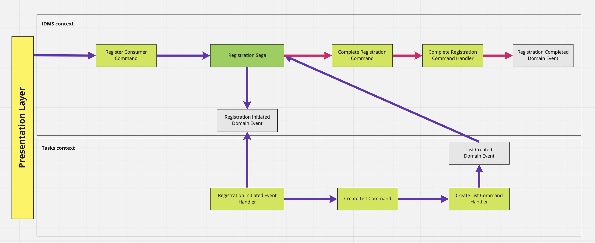

## CQRS and Sagas

In this project, I applied a CQRS pattern.
In the example below, we can see how the CQRS approach can be organized with separate write and read models based on create list flow:

I've implemented a simplified version of such communication in the current application, where we use the same persistence model for both read and write operations.
Read repository incapsulates inside write repository and use it to extract domain objects and convert them to read model objects.

Saga pattern using in cases when you need to bring transaction consistency to the distributed system.
Saga has its state of operation and can coordinate process by calling commands in separate contexts and handling domain events from those contexts. Saga should be capable of remediating in situations where an error occurred in the middle of the process and be able to revert changes 
which is already committed to other services.

